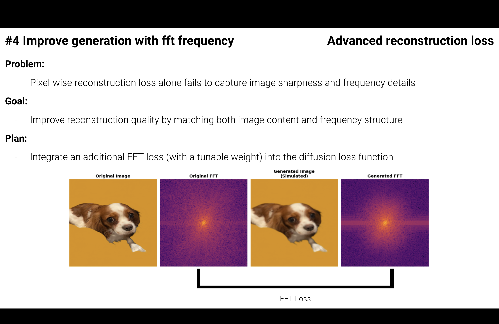
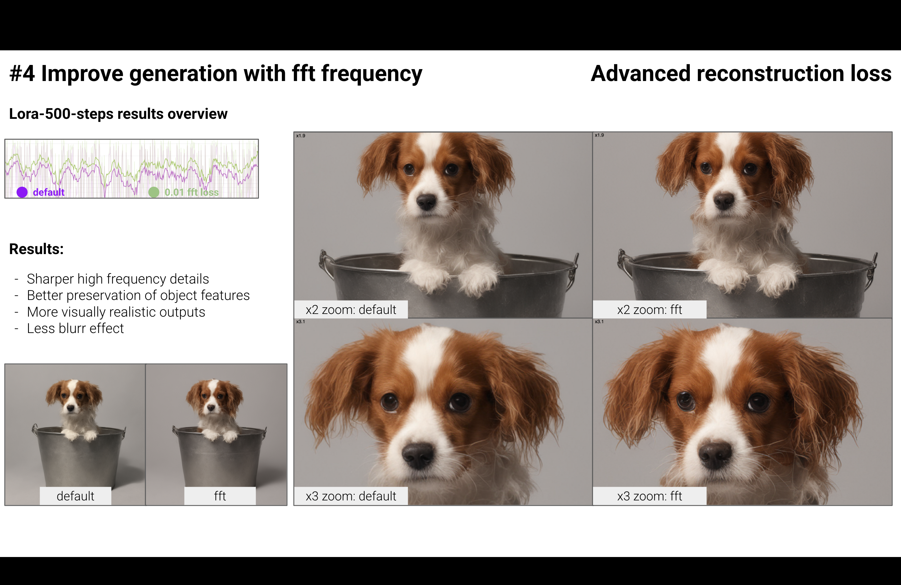

# Experiment: FFT Loss Integration for DreamBooth LoRA

In this experiment, I integrated an FFT (Fast Fourier Transform) loss into the fine-tuning process of a LoRA adapter for DreamBooth.

The **main diffusion loss** is computed in latent space, as in standard Stable Diffusion: mean squared error (MSE) between the predicted and true noise.

The **FFT loss** is applied in pixel space: after decoding the model’s latent outputs with a VAE, both the generated and target images are transformed into the frequency domain, and their spectral difference is penalized.

**Training Objective:**  
At each diffusion timestep *t*, the model minimizes:

$$
\mathcal{L}_{\text{total}} = \mathcal{L}_{\text{diffusion}}(z_t, \epsilon) + \alpha \cdot \mathcal{L}_{\text{FFT}}(x_\text{decoded}, x_\text{target})
$$

where:  
L_diffusion — MSE between predicted and target noise in latent space;  
L_FFT — L1 (or L2) distance between magnitude spectra of the decoded and target images in pixel space;  
alpha — tunable FFT loss weight (typically 0 to 0.001);  
z_t — latent at timestep t;  
epsilon — true noise;  
x_decoded — VAE-decoded prediction;  
x_target — ground-truth image.

This combined loss is calculated at each diffusion step, encouraging the model to match both latent noise structure and frequency content in pixel space.

As a result, this approach helps the model better retain both low- and high-frequency characteristics of the target object, leading to improved fine details and overall structure in generated images.

## FFT Loss Integration

FFT loss is computed between the frequency spectra of the original and generated images.

*Figure: From left to right—Original image, its FFT spectrum, simulated generated image, and its FFT spectrum. The FFT loss is calculated between the two spectra to improve both high- and low-frequency fidelity in fine-tuning.*

## Visual results example

Below is a comparison of the default setup and the FFT loss integration for DreamBooth LoRA fine-tuning.

*Figure: Left—Default results, Right—FFT loss integration. Zoomed crops illustrate improved detail retention and realism with FFT loss.*

**Results:**  
- Sharper high-frequency details  
- Better preservation of object features  
- More visually realistic outputs  
- Less blur effect
